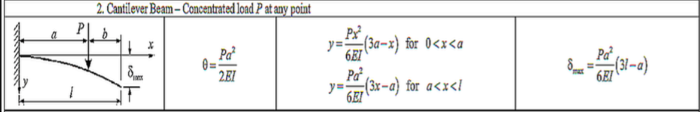
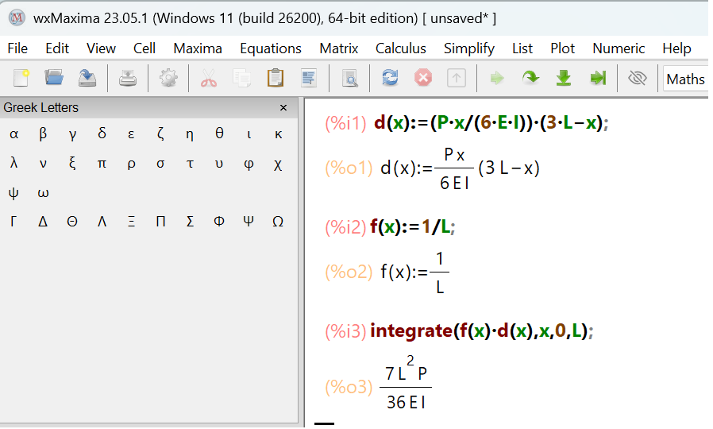
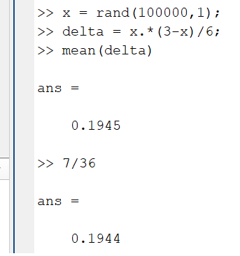

# Cantilever Homework

Recall the problem: a load P is randomly applied at some location x on the cantilever.
The length of the cantilever is L, with properties E and I. If all locations of load P along length L are equally likely, what is the average maximum deflection of the cantilever?

## Solution

You can look up the equation for the deflection of a cantilever with a load P applied at location a:

We care about the average maximum deflection.

The Probablity Distribution Function (PDF) for the load location is:

$f(x)= 1/L$

which is valid over bounds x = 0 to L.

The equation for the average deflection is:

$\bar\delta = \int_{0}^{L} f(x) \delta(x) dx$

where the picture above gives us the delta equation:

$\delta(x)= \frac{Px}{6EI}(3L-x)$

So:

$\bar\delta = \int_{0}^{L} \frac{1}{L} \frac{Px}{6EI}(3L-x) dx$

which can be shown to be equal to:

$\bar\delta = \frac{7PL^2}{36EI}$

You can check your solution in Maxima:

You can also check it in MATLAB by assuming P = 1, E = 1, L = 1 and I = 1:

That's close enough.
