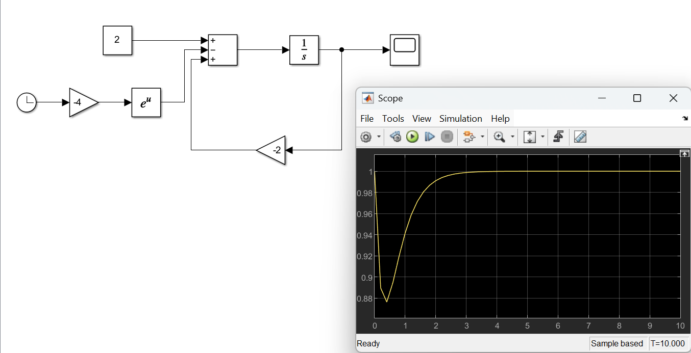
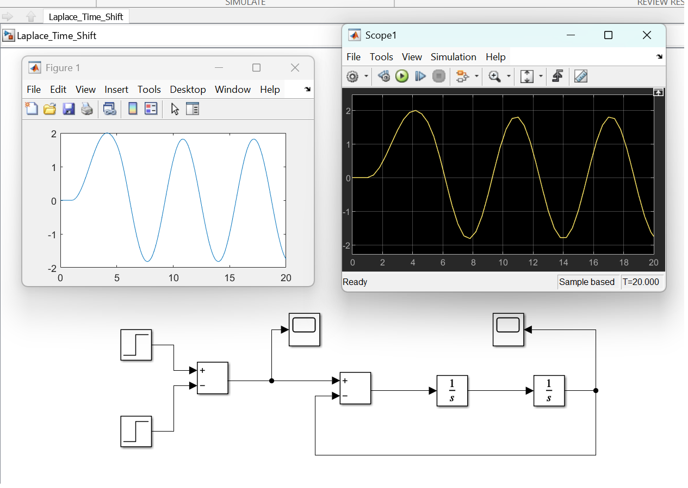
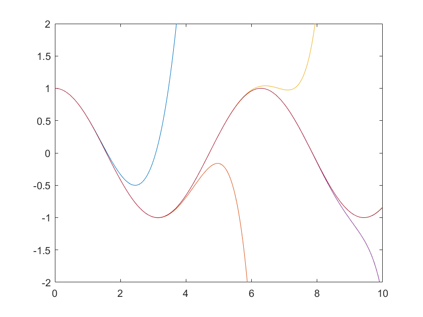
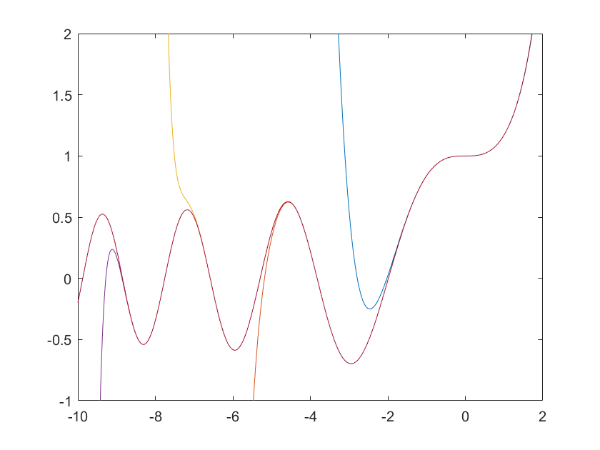

# NCKU-engineering-maths
A collection of tools and docs to support the NCKU class on engineering mathematics.

## Euler's Method Example

Here we solve the ODE:

```math
\frac{dy}{dt} + 2y = 2 - e^{-4t}
```
where y(0) = 1 using dt = 0.1 with Euler's method and Simulink.

The best way to prepare yourself for solving this ODE using a numerical method is to rewrite the ODE in terms of the lowest derivative:

```math
\frac{dy}{dt} = 2 - e^{-4t} - 2y
```

And updating the value of y at step k+1 using:

```math
y(k+1) = y(k) + (\frac{dy}{dy})_k \Delta t
```

The working is shown in class (on the board), but when we are done (after 5 or so steps) we have a table of points which looks like:

| t | y |
|---|---|
| 0 | 1 |
| 0.1 | 0.9 |
| 0.2 | 0.852967995 |
| 0.3 | 0.8374415 |
| 0.4 | 0.839833779 |
| 0.5 | 0.851677371 |

To check this result, you could use the analytical solution - or you could numerically integrate the ODE using Simulink. The simulink file is found [here](./Euler_Example/Euler_Example.slx) but looks like this and produces this result:



## Time Shifting using Laplace (2nd shifting theorem)

Consider a mass (1 kg) attached to a spring (k = 1 N/m) with a force applied to it f(t). The governing ordinary differential equation is:

```math
x'' + x = f(t) 
```

In the problem we cover in class, f(t) is a unit step force of 1N, activating at t = 1 and stopping at t = 5. We can write this as:

```math
f(t) = u(t-1) - u(t-5)
```

The analytical solution to this can be found using the 2nd shifting theorem (or the t-shifting theorem). The Laplace transform of the governing ODE can be shown to be:

```math
s^2X(s) + X(s) = (\frac{1}{s})(e^{-s} - e^{-5s})
```

which has the solution for X(s):

```math
X(s) = \frac{e^{-s}}{s(s^2+1)} - \frac{e^{-5s}}{s(s^2+1)}
```

The inverse Laplace transform (shown in class) gives the final answer:

```math
x(t)=(1-cos(t-1)u(t-1)) - (1-cos(t-5))u(t-5)
```

The MATLAB code to plot this function from the command line is:

```bash
t = 0.01:0.01:20;
u1 = (t > 1);
u2 = (t > 5);
x = (1 - cos(t-1)).*u1 - (1 - cos(t-5)).*u2;
plot(t, x)
```


We can check our answer using Simulink. The model for Simulink is shown below, and can be found [here](./Laplace_Time_Shift/Laplace_Time_Shift.slx).



The comparison of the analytical solution is shown next to the result from simulink - again, showing that Simulink is a useful tool for quickly checking your analytical solutions.


## Series Solutions to ODEs - Example A

This example shows how we can apply a power series to solve the ODE:


```math
y'' + y = 0
```

The general solution to this ODE is already well known - it takes the form:

```math
y(x) = A.cos(x) + B.sin(x)
```

where the values of A and B depend on the initial conditions of the ODE.

In the case where the value of A is 1, and B is 0 (i.e. y(0) = 1 and y'(0) = 0) the series solution can be shown to be:


```math
y(x)=\sum_{n=0}^{\infin} \frac{(-1)^n}{(2n)!}x^{2n}
```
We can run the code (found [here](./Series_Solution_A/Series_Solution_A.m)) to see what happens as we increase the number of terms in the series - we can see that as n increases, the power series looks more and more like cos(x) - the known solution.



## Series Solutions to ODEs - Example B - Airy's Equations

Airy's equation can be written as:

```math
y'' - xy = 0
```
and are described in some detail in Wikipedia [here](https://en.wikipedia.org/wiki/Airy_function).

The numerical solution can be obtained by assuming a power series solution, which is far simpler than using (for instance) Laplace transforms in this case. The value of each term, and the total sum, can be shown to be computed as follows:

```matlab
function [sum] = term1(no_terms, x)
    % This function computes the first possible solution of Airy's eqns
    sum = 1; % This solution starts with 1
    % Set a0 = 1
    a0 = 1;
    % Now we need to compute each term in the series at point x
    % The first term was 1; we start at term n = 1 and larger
    numerator = 1;
    for term = 1:1:no_terms
        numerator = numerator*(3*term).*(3*term - 1);
        sum = sum + x.^(3*term)./numerator;
    end
    % Multiply by a0 (even though its 1 in this case)
    sum = sum*a0;
end
```

The graph of the solution for increasing numbers of terms is:

