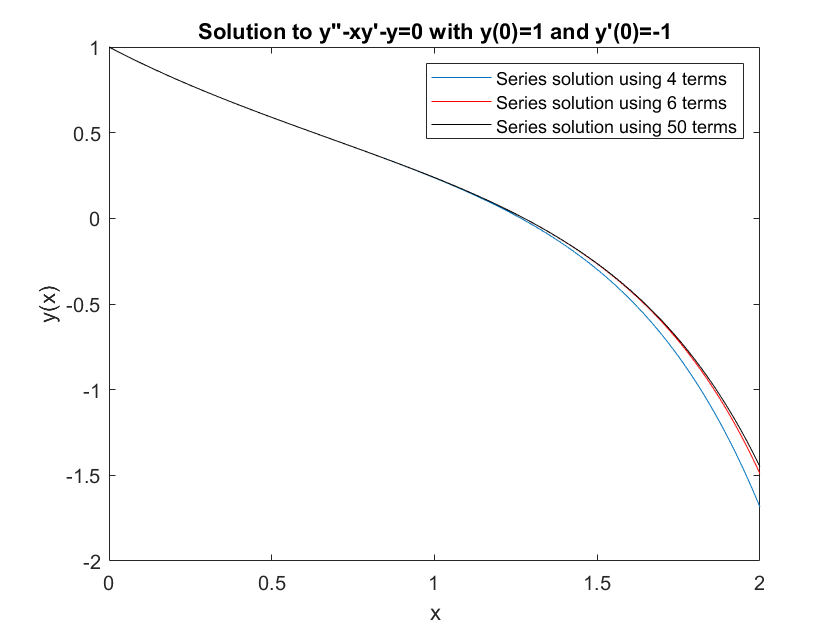
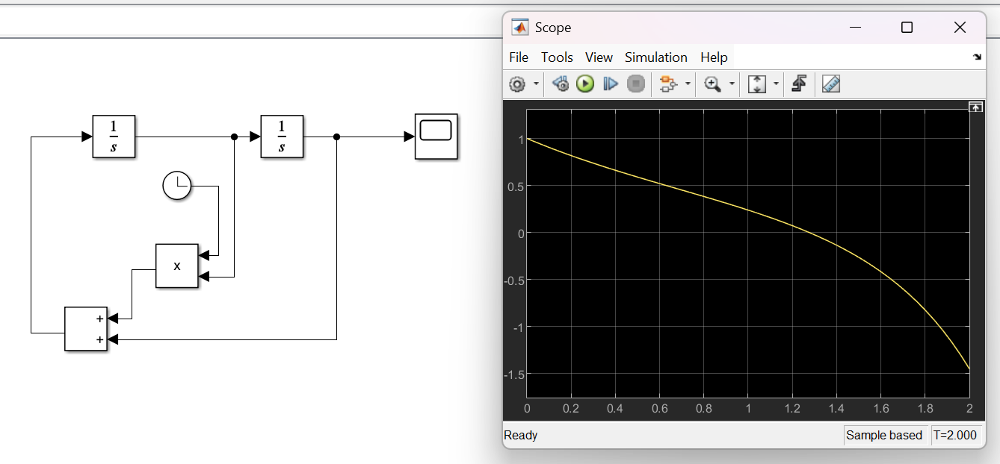

# Series Solution to ODE - Demonstration A

This code shows the results from the series solution to this ODE:

$y''-xy'-y=0$

with $y(x=0) = 1$ and $y'(x=0) = -1$. In class, I showed the analytical solution to be:

$y(x) = a_0\left(1 + x^2/2 + x^4/2.4 + x^6/2.4.6 + ... x^{2n}/2^n n!\right) + \\ a_1\left(x + x^3/3 + x^5/3.5 + x^7/3.5.7 .... 2^n n! x^{2n+1}/(2n+1)!\right) $

In this folder there are two m codes:
* Compute_Series_A.m : Holds a function called Compute_Series_A which computes the sums above, using a given x value, number of terms N and initial conditions $a_0$ and $a_1$.
* Solve_ODE.m: Holds a function called Solve_ODE() which computes y(x) for x = 0 to 2 and plots the results. In this code, my series computation uses 10 terms at each x - you can increase (or decrease this) to see how the number of terms affects the accuracy.

Here are the results:

This can be checked using Simulink - I've also included the model in this folder for you to load and run:

