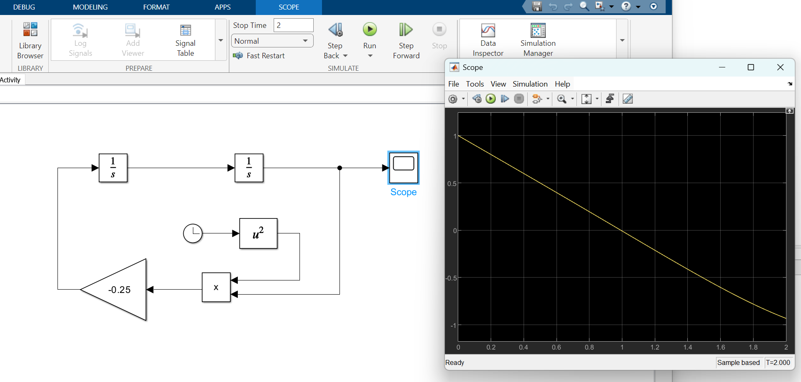
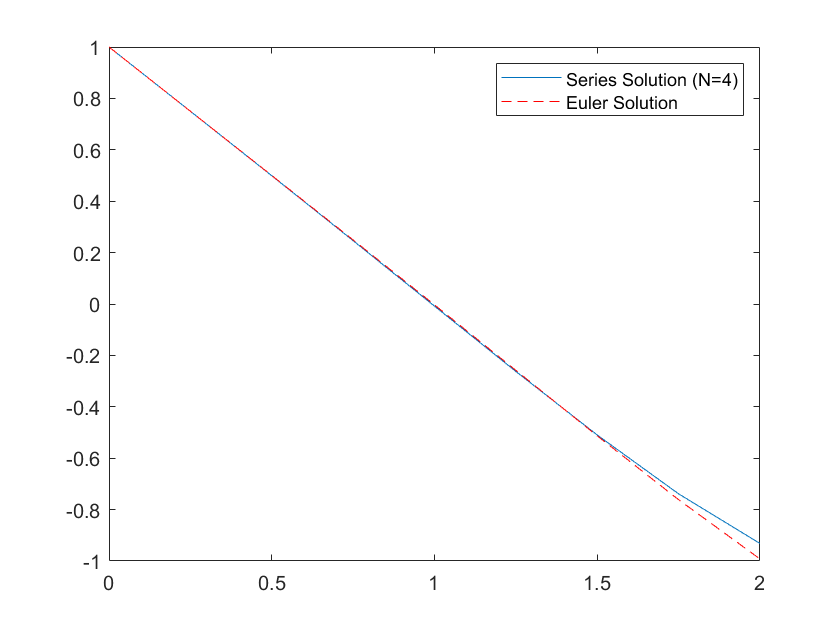

# Series Solutions to ODEs - Another Example

This example focuses on the series solution to this ODE:

$y'' + k^2 x^2 y = 0$

where $y'' = d^2 y / dx^2$ and $k$ is a constant - in this case, $k=0.5$. For numerical solutions and testing, we'll use the initial conditions $y(x=0) = 1$ and $y'(x=0) = -1$.

Using 4 terms, the series is most easily shown in the MATLAB function below:

```matlab
function [solution] = Compute_Sum(x,a0,a1)
    k = 0.5;
    % Compute each series to 4 terms
    y1 = a0.*(1 - (k.^2.*x.^4/(3*4)) + (k.^4.*x.^8/(3*4*7*8)) - (k.^6.*x.^12/(3*4*7*8*11*12)));
    y2 = a1.*(x - (k.^2.*x.^5/(4*5)) + (k.^4.*x.^9/(4*5*8*9)) - (k.^6.*x.^13/(4*5*8*9*12*13)));
    solution = y1 + y2;
end
```

It would be an excellent idea to rewrite this function to take N as an argument, and then use a for loop to evaluate N terms - I'll leave this as an exercise to the student; other codes in this repository demonstrate this. In this case, we'll stick to a fixed number of terms.

We can use simulink to check the answer to x = 2. Remember, in this example, x can be thought of as time:



When you run the MATLAB code in this folder, you can see the Euler Solution together with the series solution for this ODE:



Which agrees.

I also encourage you to try simulating this ODE to $x = 5$; you'll see the solution becomes more interesting!